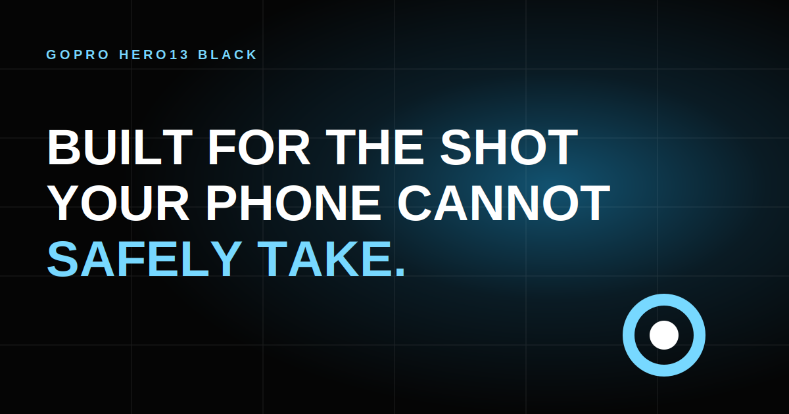

# HERO13 Black — Cinematic Product Landing

An unofficial portfolio concept exploring how motion, 3D product presentation,
and focused interaction design can turn a technical product story into a
cinematic web experience.

[Live Demo][live-demo] · [Watch Video][demo-video]

[][demo-video]

## Highlights

- Scroll-directed 3D product storytelling with GSAP ScrollTrigger and Three.js.
- A responsive product route that adapts camera position, scale, and rotation.
- Purpose-built sections for performance, stabilization, ruggedness, battery,
  mounting, lens mods, and product comparison.
- An accessible simulated preorder flow that validates data locally and never
  submits or stores personal information.
- Responsive layouts and reduced-motion support across desktop, tablet, and
  mobile viewports.

## Stack

- Vite
- Vanilla HTML, CSS, and JavaScript
- GSAP + ScrollTrigger
- Three.js + GLTFLoader

## Run locally

```bash
npm install
npm run dev
```

Create the production build with:

```bash
npm run build
```

## Credits

The camera model is provided by
[Configcars](https://sketchfab.com/maxipub) under
[CC BY 4.0](https://creativecommons.org/licenses/by/4.0/).

This project is not affiliated with or endorsed by GoPro. GoPro and HERO are
trademarks of GoPro, Inc.

[live-demo]: https://landing-gopro-hero13.vercel.app/
[demo-video]: https://youtu.be/znBk_CKzRaw
